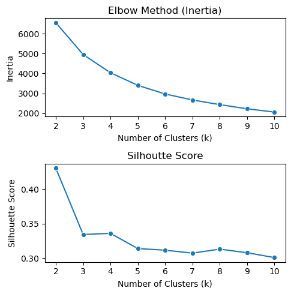
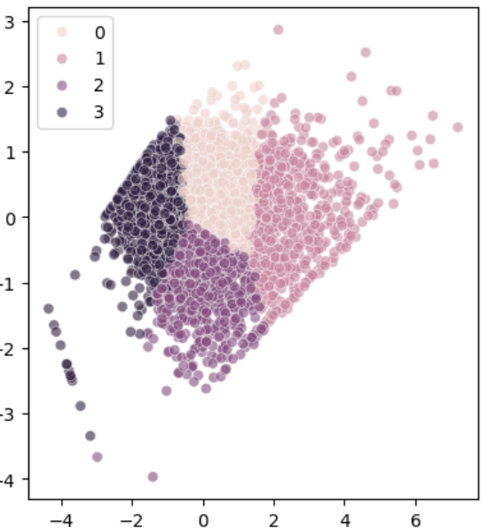
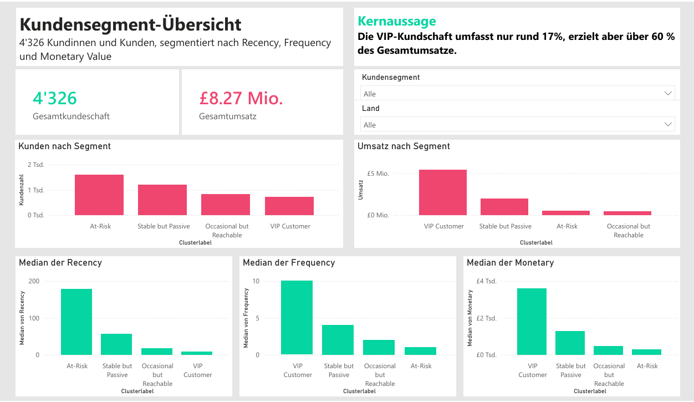

# Online Retail — Customer Segmentation with RFM & K-Means

Repo: [github.com/Itaru2018/online_retail](https://github.com/Itaru2018/online_retail)

End-to-end customer segmentation of a UK-based online retailer's transaction history, using RFM (Recency, Frequency, Monetary) feature engineering and K-Means clustering to identify distinct customer groups and support targeted marketing actions.

## Dataset

541,909 transactions from a UK-based online retailer. After cleaning, 4,326 customers remain in the final RFM/cluster dataset.

## Initial EDA & Data Cleaning

- **Missing values:** `Description` is missing in ~0.27% of rows, and whenever it's missing, `CustomerID` is missing too. `CustomerID` is missing in ~25% of rows. Rows missing `Description` were dropped (negligible impact, no `CustomerID` either). Rows missing `CustomerID` were also dropped — `CustomerID` is essential for segmentation, and over 406,000 valid records remain afterward, which is sufficient for the analysis.
- **Negative `Quantity` values:** investigated rather than dropped. All associated invoice numbers start with `C`. The hypothesis that each cancellation (e.g. `C536379`) has a matching original invoice without the `C` prefix (e.g. `536379`) was tested and did not hold — matching invoice numbers weren't found. Looking instead for records with the same `StockCode` and `CustomerID` as the last 10 `C`-prefixed orders (chosen so the original purchase would likely have already been captured earlier in the dataset) showed many matches, confirming these negative-quantity rows represent **cancellations**, and in some cases **discounts**. These rows were kept, since they carry information about cancellation and discount behavior.
- **`StockCode` == 'M':** rows with `StockCode` "M" and `Description` "Manual" were investigated on the hypothesis that they represent system- or staff-initiated corrections. Checking all single-character `StockCode` values confirmed only two exist: `D` (Discount) and `M` (Manual). `M` rows contain both positive and negative quantities, consistent with adjustments/corrections rather than normal purchases. These rows were kept at the cleaning stage (needed to calculate total monetary value per customer accurately) with the decision on how to treat them deferred to the RFM/analysis stage.
- **Duplicates:** 5,225 exact duplicate rows (identical across all columns) were found and removed as likely data-entry/system errors; immaterial given 400,000+ remaining rows.
- **`InvoiceNo` / `StockCode` datatypes:** both contained a mix of numbers and letters; the numeric-looking values were confirmed to be stored as integers and converted to strings for consistency.
- **`Country` consistency:** checked for inconsistent capitalization/whitespace (none found) and for typos/inconsistent spacing using fuzzy string matching. The only near-match pair flagged was "Australia" and "Austria" — genuinely different countries, not a typo — confirming the column is clean.

## RFM Analysis

RFM = **Recency** (days since last purchase), **Frequency** (number of invoices), **Monetary** (total amount spent).

Because rows with negative quantities (discounts, cancellations) and `StockCode` == 'M' (manual corrections) could distort RFM if included naively, the data was separated into four groups — discounts, manual entries, cancellations, and valid purchases — and:
1. Recency and Frequency were computed from valid purchase transactions only.
2. An **Adjusted Monetary** value was computed, excluding discounts, cancellations, and manual corrections.
3. Flag columns were created (`IsDiscount`, `IsManual`, `IsCancellation`) to allow later interpretation of how these behaviors relate to different customer segments.

Customers with negative Adjusted Monetary values (under 1% of the customer base) were excluded from the analysis — these arise from the dataset's limited time window capturing a cancellation without its corresponding purchase, and don't reflect genuine customer value.

**Country per customer:** customers who purchased from more than one country (0.18% of the base) were flagged with an `IsMultiCountry` indicator; the country field itself retains the first country each such customer appears with.

## K-Means Clustering

- The three RFM features were right-skewed; log transformation was applied (K-Means is sensitive to feature scale and distribution). Square-root transformation was also tested but was less effective than log, so log was used for all three features.
- **Choosing k:** Inertia (Elbow method) and Silhouette Score were used together, since they capture different things — compactness vs. separation. Inertia's improvement slows noticeably after k=3. Silhouette Score peaks at k=2, but that likely under-segments the data; it does not decrease between k=3 and k=4. Both k=3 and k=4 produced well-separated clusters under PCA visualization. **k=4** was selected, since the extra cluster could reveal more detailed customer behavior.

### Selecting the Number of Clusters



### PCA Visualization of the Final Four Customer Segments


## Cluster Profiles (log-transformed features used for interpretation)

| Cluster | Label | Recency | Frequency | Monetary | Business Value |
|---|---|---|---|---|---|
| 1 | VIP Customer | Very recent (lowest) | Highest | Top spenders — **over 60% of total revenue** | Most valuable, highly engaged; prioritize retention & loyalty |
| 0 | Stable but Passive | Not very recent (3rd lowest) | Moderate (2nd highest) | 2nd highest — **over 20% of total revenue** | Solid revenue, low engagement; upsell/re-engagement potential |
| 2 | Occasional but Reachable | Somewhat recent | Rare (low) | Low, small revenue share | Low engagement but not lost; promotional incentives could increase activity |
| 3 | Largest Churn / At-Risk | Not recent at all (highest) | Very infrequent | Minimal | Largest group; least active; biggest reactivation (win-back) opportunity |

## Additional Behavioral Analysis

**Discount Sensitivity by Cluster**
Discount usage is extremely low across all clusters (all below 1%), meaning promotions do not strongly influence purchasing decisions. VIP customers show slightly higher discount usage (~0.7%); since they already purchase frequently and generate the highest revenue, increasing discounts for them would mainly reduce margins — exclusive benefits (loyalty rewards, early access) are considered more suitable than price reductions. Other clusters show almost no discount response. It's also noted that customers may simply be unaware of discount campaigns, in which case better-targeted, clearly communicated campaigns could still be effective — worth further investigation.

**Cancellation Rate by Cluster**
Cancellation rates are high across all customer groups, raising possible operational concerns:
- VIP customers (Cluster 1): highest cancellation rate, more than 50% — despite strong engagement, suggesting possible quality or fulfillment issues.
- Stable but Passive Customers (Cluster 0): more than 47%, which may damage trust and prevent conversion to VIP.
- Largest Churn/At-Risk Customers (Cluster 3): more than 37% — poor past experience may contribute to inactivity.
- Occasional but Reachable Customers (Cluster 2): lowest, more than 26%, likely due to lower purchase frequency overall.

**Country Analysis by Cluster**
37 unique countries are present. The United Kingdom dominates every cluster as the primary market. Excluding the UK, Germany and France appear repeatedly among the top countries in every segment — identified as the next key markets for international expansion, behind the UK as the core market.

## Conclusion

This RFM segmentation identified four distinct customer groups with clear behavioral differences:
- **VIP customers (Cluster 1)** are the most profitable and should be prioritized with loyalty-driven strategies.
- **Cluster 0** offers strong upsell potential through improved engagement.
- **Cluster 2** needs activation strategies.
- **Cluster 3** represents the largest churn risk and the biggest win-back opportunity.
- **Discount promotions** currently show very low effectiveness across all segments.
- **Cancellation rates** are high across all groups, pointing to a need for operational improvement.
- **The UK dominates** as the core market; **Germany and France** are the key expansion targets.

Suggested next business actions: a loyalty program for VIPs, personalized re-engagement for less active groups, investigation into the operational causes of cancellations, and targeted marketing efforts in Germany and France.

## Power BI Dashboard

The cluster assignments were brought into an interactive Power BI dashboard to make the segmentation usable for non-technical stakeholders. It surfaces total customers, total revenue, and per-cluster comparisons of customer count, revenue, recency, frequency, and monetary value, with slicers for cluster and country.



## Tech Stack

Python · pandas · numpy · scikit-learn (K-Means) · rapidfuzz · matplotlib · seaborn · Power BI

## Deliverables

- `dashboard/rfm_final_cluster.csv` — cleaned RFM features + cluster assignment (4,326 customers).
- `dashboard/online_retail_dashboard.pbix` — interactive Power BI dashboard built on the RFM/cluster data.

## Repo Structure

```
online_retail/
├── data/
│   └── Online Retail.xlsx
├── notebook/
│   └── online_retail.ipynb
├── dashboard/
│   └── rfm_final_cluster.csv
└── online_retail.yml
```

## How to Run

```bash
git clone https://github.com/Itaru2018/online_retail.git
cd online_retail
conda env create -f online_retail.yml
conda activate online_retail
jupyter notebook notebook/online_retail.ipynb
```
